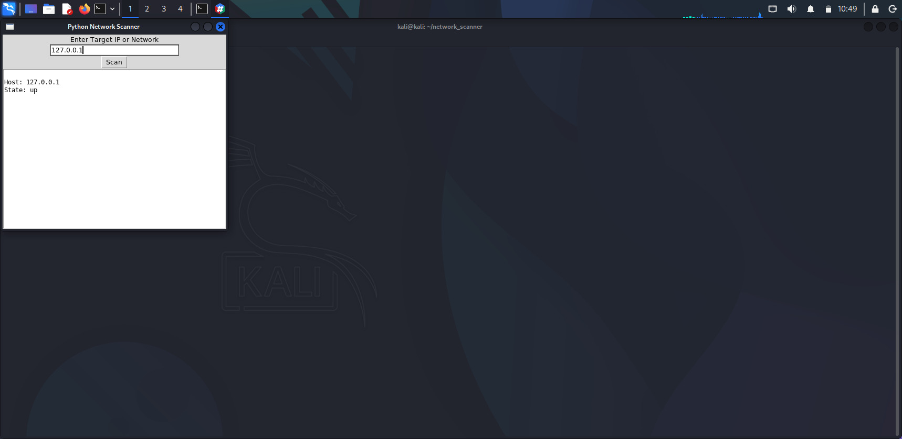
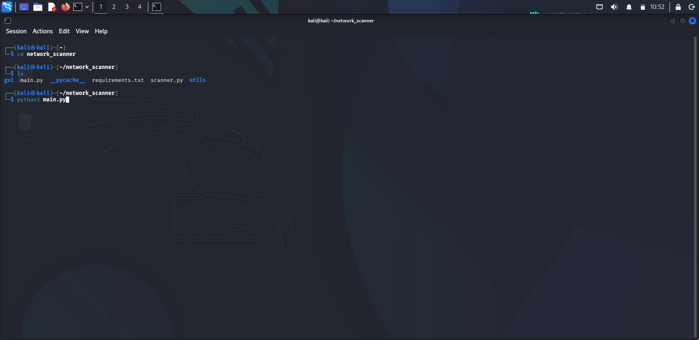

# 🌐 Network Scanner GUI (Python + Nmap)

A simple **Python-based Network Scanning Tool with GUI** that helps users discover devices and open ports on a network.

This tool uses **Nmap for network scanning** and provides an **easy-to-use graphical interface** built with Tkinter.

The application can:

* Discover active hosts in a network
* Scan open ports on devices
* Display scan results in a graphical interface
* Perform basic network reconnaissance for educational purposes

---

# 📌 Features

### 1️⃣ Host Discovery

Scans a target IP address or network range to identify **active devices**.

Example target formats:

```
192.168.1.1
192.168.1.0/24
```

Output example:

```
Host: 192.168.1.1
State: up
```

---

### 2️⃣ Port Scanner

Scans common ports to identify **open services running on devices**.

Default scan range:

```
Ports: 1 – 1024
```

Example result:

```
Port 22: open
Port 80: open
Port 443: open
```

---

### 3️⃣ Graphical User Interface

The tool provides a **simple GUI interface** where users can:

* Enter a target IP or network
* Start a scan with a button
* View results in a scrollable output window

This makes the scanner easy to use without command-line knowledge.

---

### 4️⃣ Scan Result Display

Scan results are shown inside the GUI in real-time.

Example output:

```
---------------------------------
Host: 192.168.1.1
State: up

Port 22: open
Port 80: open
Port 443: open
```

---

# 📸 Screenshot

Below is a demo of the **Network Scanner GUI Tool**.

Network Scanner GUI Demo

*(Add a screenshot of the running GUI in the `screenshots/` folder.)*

### CMD


### Scan Results



---

# 📂 Project Structure

```
network-scanner/
│
├── main.py              # Application entry point
├── scanner.py           # Network scanning logic using Nmap
│
├── gui/
│   ├── __init__.py
│   └── gui_app.py       # GUI interface built with Tkinter
│
├── requirements.txt
├── README.md
│
├── reports/             # Optional scan reports
│   └── scan_report.txt
│
└── screenshots/
    └── demo.png
```

---

# ⚙️ Requirements

Install the required dependencies before running the tool.

System requirements:

* Python 3.8+
* Nmap
* Tkinter

Install Python dependency:

```
pip install python-nmap
```

Linux users may also need:

```
sudo apt install nmap python3-tk
```

---

# ▶️ How to Run

Clone the repository:

```
git clone https://github.com/yourusername/network-scanner.git
```

Navigate to the project directory:

```
cd network-scanner
```

Run the program:

```
python3 main.py
```

The GUI window will open.

---

# 🖥️ How to Use

1. Enter a **target IP address or network range**
2. Click the **Scan** button
3. Wait for the scan to complete
4. View discovered hosts and open ports in the output window

---

# 🔐 Security Concepts Used

This project demonstrates several important **network security concepts**:

* Network reconnaissance
* Port scanning
* Host discovery
* Service detection
* Network enumeration

It also demonstrates **integration between Python and Nmap**.

---

# 🚀 Future Improvements

Possible upgrades for this tool:

* OS detection
* Service version detection
* Scan progress bar
* Export scan reports (TXT / JSON / PDF)
* Dark mode GUI
* Multi-threaded scanning
* Network topology visualization

---

# 📚 Learning Purpose

This project is useful for beginners learning:

* Python scripting
* Network scanning techniques
* Cybersecurity fundamentals
* GUI application development
* Nmap automation with Python

---

# ⚠️ Disclaimer

This tool is intended **for educational purposes and authorized testing only**.

Do **not scan networks without permission**.

Unauthorized scanning may violate laws or network policies.

---

# 👨‍💻 Author

whitewolf01028

Cybersecurity Practice Project.

If you like this project, consider ⭐ **starring the repository**.
